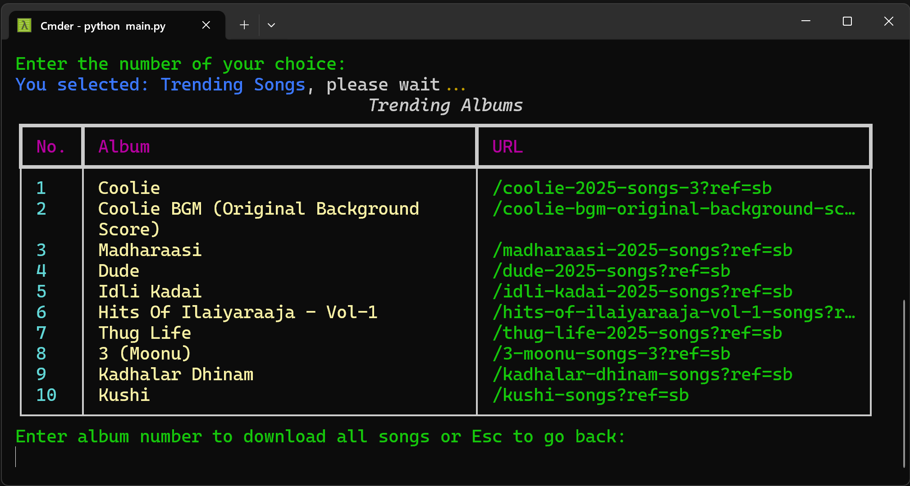
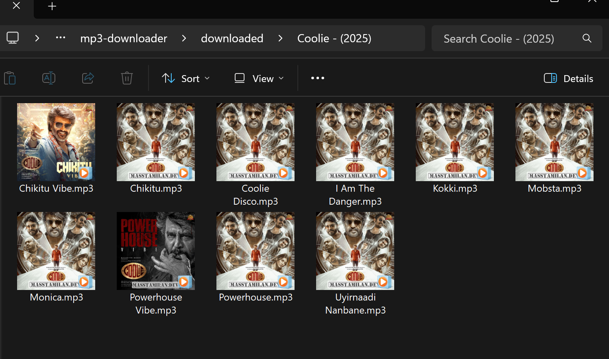
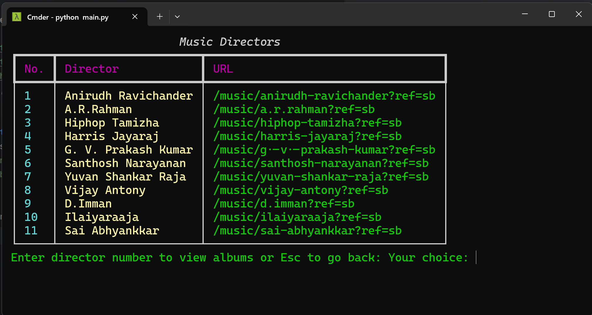
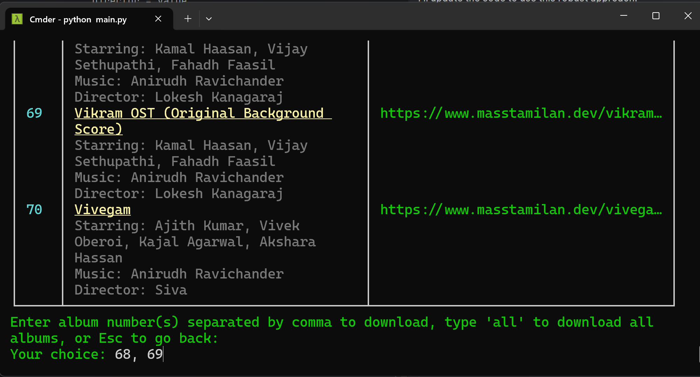
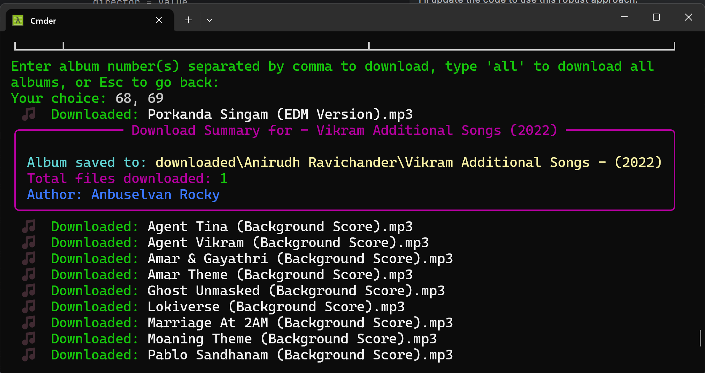
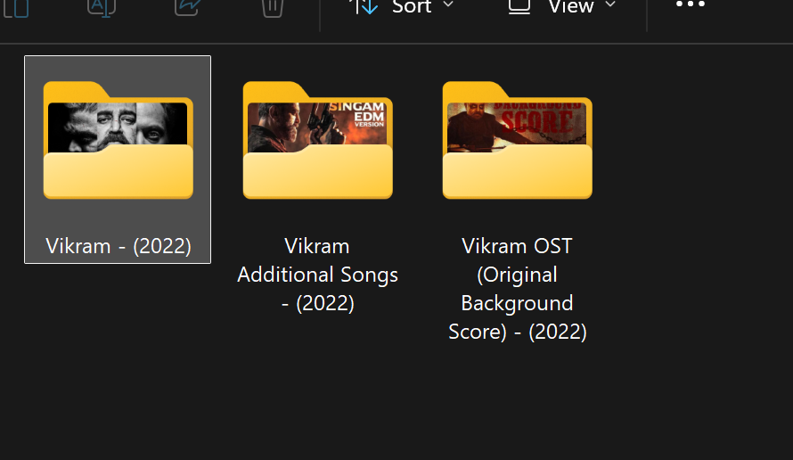

## 🖼️ Complete Guide

1. [Fork and clone](https://github.com/anburocky3/mp3-downloader/fork) the repository.
2. Install Python 3.10 or higher from [python.org](https://www.python.org/downloads/).
3. Open a terminal and type `cd mp3-downloader` to navigate to the cloned directory.
4. Run `pip install -r requirements.txt` to install the required libraries.
5. Execute `python main.py` to start the application.
6. Follow the on-screen prompts to select language, download type, and albums.

7. Choose your 🌐 Language Selection

   

8. Choose your preferred music language and enter the corresponding number and Enter.

9. Choose your 📥 Download Type, Select whether to download trending albums or by music director.

   

10. If you select "Trending Albums", a list of trending albums will be displayed. Enter the album number you wish to download.

    

11. Once you have entered the album number, the download will begin.

    

12. The MP3 files will be saved in the `downloaded/` folder, organized by album title.

    

13. If you select "By Music Director", a list of music directors will be displayed. Enter the director number to see their albums.

    

14. Enter the album number you wish to download from the selected director. You can enter multiple album numbers separated by commas. Or enter `all` to download all albums by that director.

    

15. For example: `68, 69` will download albums 68 and 69. if you type `all`, it will download all albums by that director.

    

15. Downloading will start and you will see the progress in the terminal.

    

16. The MP3 files will be saved in the `downloaded/` folder, organized by director and album.
17.

17. Enjoy your music! 🎶
