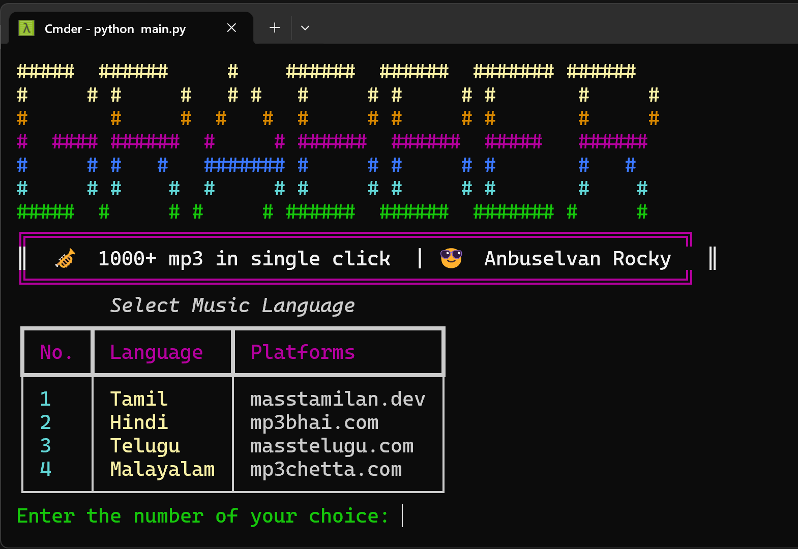
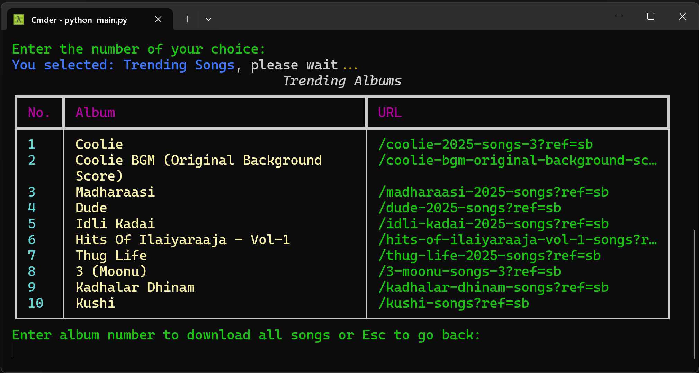
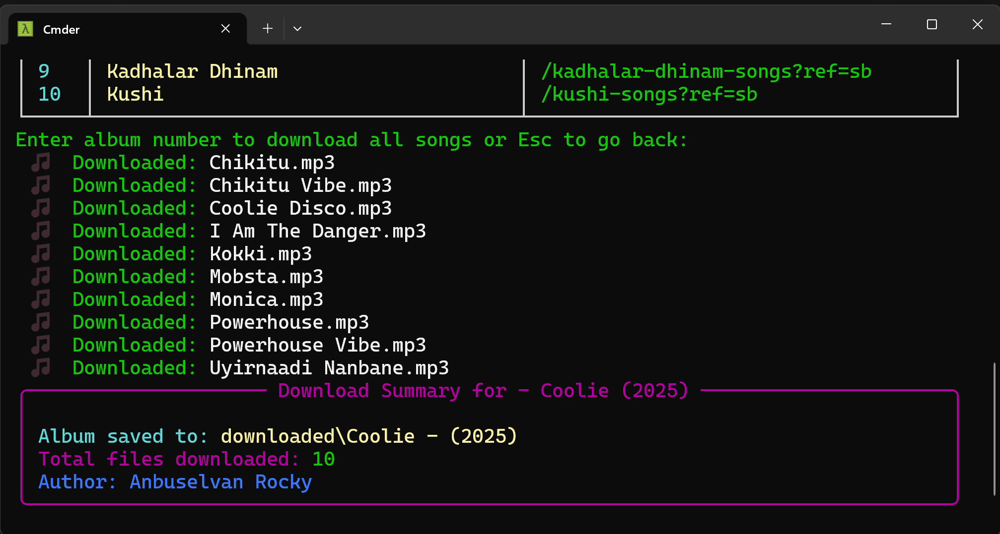
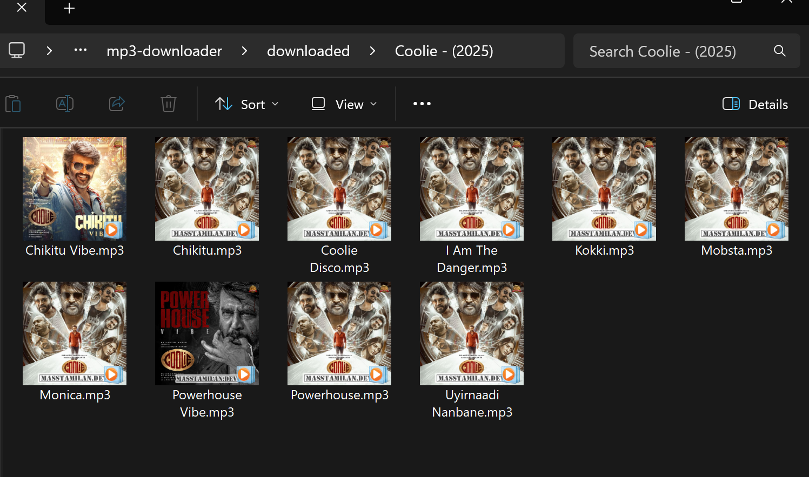
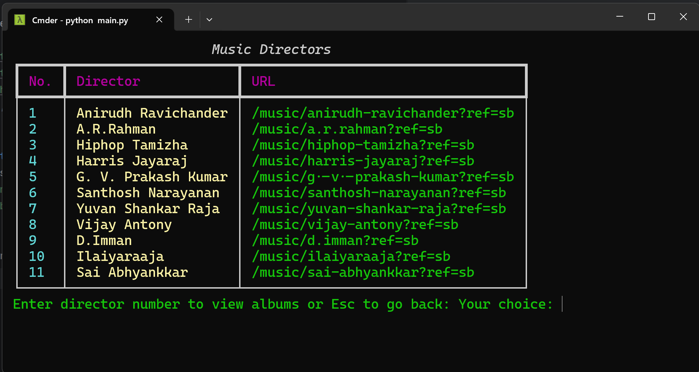
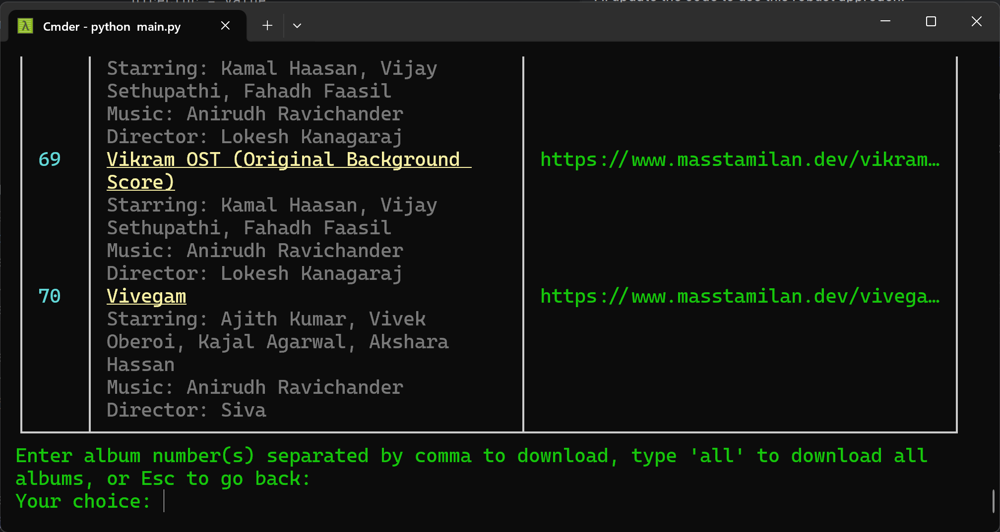
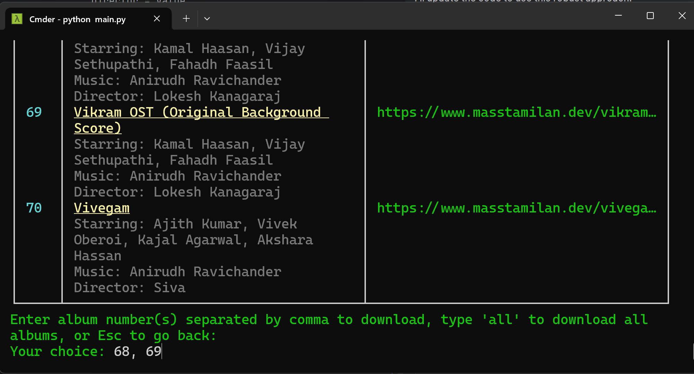
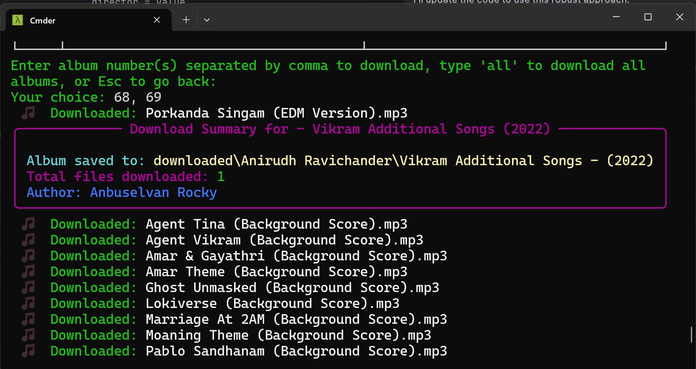
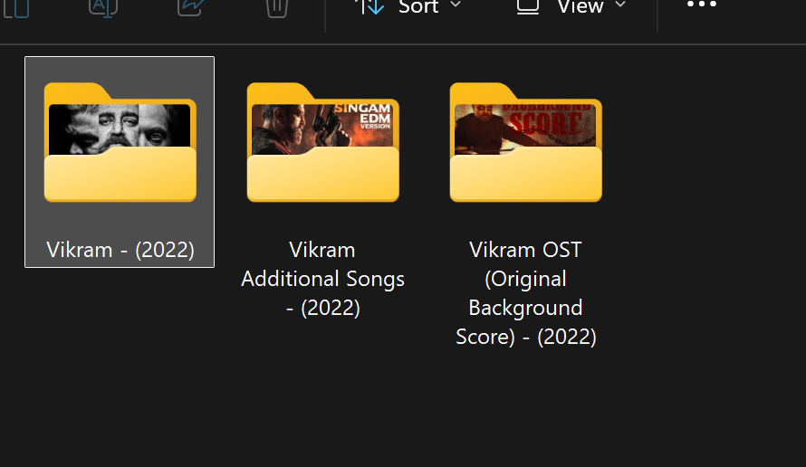

# 🎼️MP3 Downloader Pro 🎺

Download thousands of music files in single click!. Supporting Tamil, Telugu, Hindi, Malayalam platforms.


<p align="center">
  
  
  
  
</p>

## 🚀 Download the Mp3Downloader.zip file 
For windows, just download the zip file and extract it. Run `MP3Downloader.exe` to start the application. 

👉  **Download it here:**

[](https://github.com/anburocky3/mp3-downloader/releases/latest)

### ✅ [Download this script](https://github.com/anburocky3/mp3-downloader/fork)

> **Use this script with caution.** We don't support piracy and this project is completely for educational purposes only. Use it with care.🥰💖

---

## 🎉 Features
- 🎵 Download trending albums or by music director
- 🌐 Supports Tamil, Telugu, Hindi, Malayalam
- 📥 Download single or multiple albums at once
- 🎨 Beautiful, colorful terminal UI (Rich)
- 🗂️ Organizes downloads by director and album
- 🖥️ Cross-platform: Windows, macOS, Linux


## 🚀 Complete Guide

1. [Fork and clone](https://github.com/anburocky3/mp3-downloader/fork) the repository.
2. Install `Python 3.10` or higher from [python.org](https://www.python.org/downloads/).
3. Open a terminal and type `cd mp3-downloader` to navigate to the cloned directory.
4. Run `pip install -r requirements.txt` to install the required libraries.
5. Execute `python main.py` to start the application.
6. Follow the on-screen prompts to select language, download type, and albums.

7. Choose your preferred **🌐 Language Selection**

    

8. Choose your 📥 Download Type, Select whether to download **trending albums** or by **music director**.

    

9. If you select **"Trending Albums"**, a list of trending albums will be displayed. Enter the album number you wish to download.

    

10. Once you have entered the album number, the download will begin.

    
 
11. The MP3 files will be saved in the `downloaded/` folder, organized by `album title`.
 
    
 
12. If you select `By Music Director`, a list of music directors will be displayed. Enter the director number to see their albums.
 
    
 
13. Enter the album number you wish to download from the selected director. You can enter multiple album numbers separated by commas. Or enter `all` to download all albums by that director.
    
    
   
14. For example: `68, 69` will download albums 68 and 69. if you type `all`, it will download all albums by that director.
  
    

15. Downloading will start, and you will see the progress in the terminal.

    

16. The MP3 files will be saved in the `downloaded/` folder, organized by director and album.

    

17. Enjoy your music! 🎶

## ⚙️ For Developers
- Build the Windows EXE using PyInstaller:
  ```bash
  .\scripts\deploy.bat # Build, deploy and release the Windows EXE in zip format
  .\scripts\build.bat  # Just build the Windows EXE
  ```
> when making changes increment the version code and update the changelog in `CHANGELOG.md`.


## 🖥️ Supported Platforms
- Windows (EXE available)
- Linux, macOS (run with Python 3.10+)

## 📑 Changelog
See [CHANGELOG.md](CHANGELOG.md) for details.

## 🤝 Contributing

Pull requests are welcome! For major changes, please open an issue first to discuss what you would like to change.

---

## Supporting downloading platforms
1. Tamil MP3 (masstamilan.dev)
2. Hindi MP3 (mp3bhai.com)
3. Telugu MP3 (masstelugu.com)
4. Malayalam MP3 (mp3chetta.com)

## 📄 License

This project is licensed under the MIT License. See [LICENSE](LICENSE) for details.

---

### Author:
[Anbuselvan Rocky](https://fb.com/anburocky3)

> For any issues or feature requests, please open an issue on GitHub.
