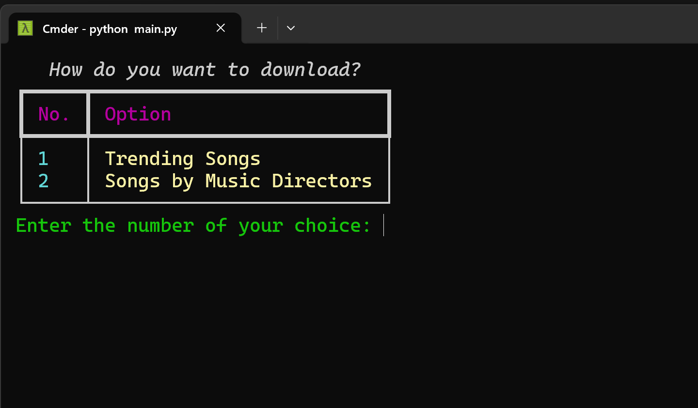

# 🎼️MP3 Downloader Pro

Download thousands of music files in single click!. Supporting Tamil, Telugu, Hindi, Malayalam platforms.


<p align="center">
  
  
  
  
</p>

---

## 🎉 Features
- 🎵 Download trending albums or by music director
- 🌐 Supports Tamil, Telugu, Hindi, Malayalam
- 📥 Download single or multiple albums at once
- 🎨 Beautiful, colorful terminal UI (Rich)
- 🗂️ Organizes downloads by director and album
- 🖥️ Cross-platform: Windows, macOS, Linux

---

## 🚀 Installation

```bash
# Clone the repository
$ git clone https://github.com/anburocky3/mp3-downloader.git
$ cd mp3-downloader

# Install dependencies
$ pip install -r requirements.txt
```

---

## 🛠️ Usage

```bash
$ python main.py
```

1. Select your music language (Tamil, Telugu, Hindi, Malayalam)
2. Choose to download trending songs or by music director
3. Enter the album or director number(s) as prompted
4. Downloaded MP3s will be saved in the `downloaded/` folder, organized by director and album

---

**## 🖼️ Complete Guide

1. [Fork and clone](https://github.com/anburocky3/mp3-downloader/fork) the repository.
2. Install Python 3.10 or higher from [python.org](https://www.python.org/downloads/).
3. Open a terminal and type `cd mp3-downloader` to navigate to the cloned directory.
4. Run `pip install -r requirements.txt` to install the required libraries.
5. Execute `python main.py` to start the application.
6. Follow the on-screen prompts to select language, download type, and albums.

7. Choose your 🌐 Language Selection

    

8. Choose your preferred music language and enter the corresponding number and Enter.

9. Choose your 📥 Download Type, Select whether to download trending albums or by music director.

    

10. If you select "Trending Albums", a list of trending albums will be displayed. Enter the album number you wish to download.

    

11. Once you have entered the album number, the download will begin.

    
 
12. The MP3 files will be saved in the `downloaded/` folder, organized by album title.
 
    
 
13. If you select "By Music Director", a list of music directors will be displayed. Enter the director number to see their albums.
 
    
 
14. Enter the album number you wish to download from the selected director. You can enter multiple album numbers separated by commas. Or enter `all` to download all albums by that director.
    
    
   
15. For example: `68, 69` will download albums 68 and 69. if you type `all`, it will download all albums by that director.
  
    

    
15. Downloading will start and you will see the progress in the terminal.

    

16. The MP3 files will be saved in the `downloaded/` folder, organized by director and album.
17. 
    

17. Enjoy your music! 🎶**

## 🤝 Contributing

Pull requests are welcome! For major changes, please open an issue first to discuss what you would like to change.

---

## 📄 License

This project is licensed under the MIT License. See [LICENSE](LICENSE) for details.

---

**Author:** Anbuselvan Rocky

For any issues or feature requests, please open an issue on GitHub.
